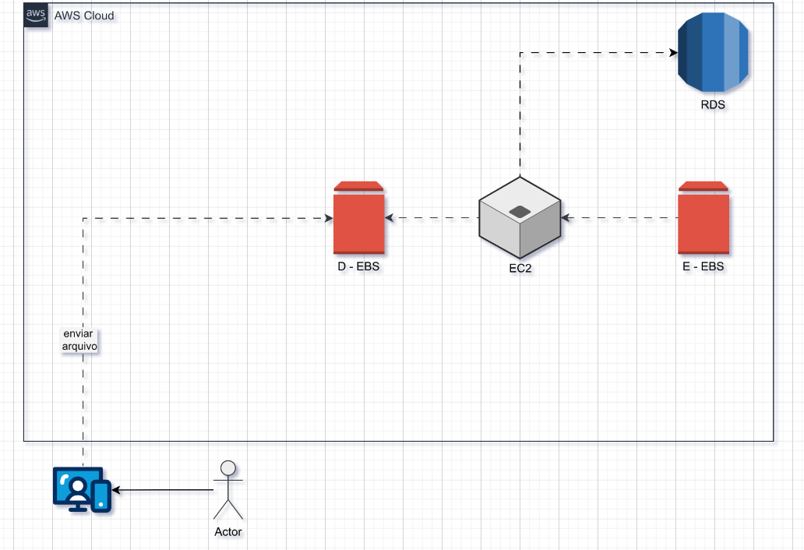

# ☁️ Desafio de Projeto: Gerenciando Instâncias EC2 na AWS

> **Bootcamp:** GFT - Fundamentos de Cloud com AWS  
> **Plataforma:** Digital Innovation One (DIO)  
> **Autor:** Evelyn Oliveira Bonatto  
> **Status:** 🛠️ Concluído  

---

## 📌 Visão Geral do Projeto

Este repositório reúne a documentação prática e o mapeamento de arquitetura desenvolvidos durante o laboratório de **Gerenciamento de Instâncias EC2 na AWS**.

O objetivo foi estruturar um ambiente computacional na nuvem AWS, cobrindo o gerenciamento de instâncias virtuais, acoplamento de múltiplos volumes de armazenamento em bloco (**EBS**) e conexão com banco de dados relacional (**RDS**).

---

## 🏗️ Arquitetura da Solução

O diagrama abaixo ilustra o fluxo de dados e a infraestrutura provisionada no desafio:

### Componentes da Arquitetura:

* **Ator / Cliente:** Representa o usuário interagindo com a aplicação e enviando arquivos para a infraestrutura.
* **Volume EBS (D - EBS):** Volume de armazenamento em bloco (*Elastic Block Store*) utilizado para recepção e persistência primária de arquivos enviados.
* **Amazon EC2:** Servidor virtual central responsável pelo processamento da aplicação e gerenciamento das operações de E/S.
* **Volume EBS (E - EBS):** Volume de armazenamento em bloco secundário anexado ao EC2 para segregação de dados/sistema.
* **Amazon RDS:** Serviço de banco de dados relacional gerenciado, conectado à instância EC2 para persistência estruturada de dados da aplicação.

---

## 🚀 Etapas de Implementação

### 1. Criando e Configurando a Instância EC2
* Seleção da AMI (Amazon Machine Image) no escopo da *Free Tier*.
* Configuração do tipo de instância (`t2.micro` / `t3.micro`).
* Geração do par de chaves SSH (`.pem`) para acesso seguro.

### 2. Anexando Volumes EBS (D e E)
* Criação de dois volumes EBS independentes na mesma *Availability Zone* (AZ) da EC2.
* Anexo (*Attach*) dos volumes aos pontos de montagem da instância para separar o SO dos arquivos de dados.

### 3. Conexão com o Amazon RDS
* Provisionamento da instância de banco de dados relacional.
* Liberação de tráfego de rede no Security Group para permitir a comunicação entre o EC2 e o RDS.

---

## 💡 Anotações e Boas Práticas

* **Multi-Volume em EC2:** Separar o disco do Sistema Operacional dos discos de dados (`D:` e `E:`) facilita snapshots, backups independentes e manutenção sem afetar o SO.
* **Desacoplamento de Dados:** O uso do RDS garante que dados relacionais permaneçam seguros e com backup automatizado, independentemente do ciclo de vida da EC2.
* **Encerramento sem Custos:** Para evitar cobranças ao finalizar o desafio, lembre-se de desalocar o RDS e **Terminar (*Terminate*)** a instância EC2 e seus volumes EBS associados.
